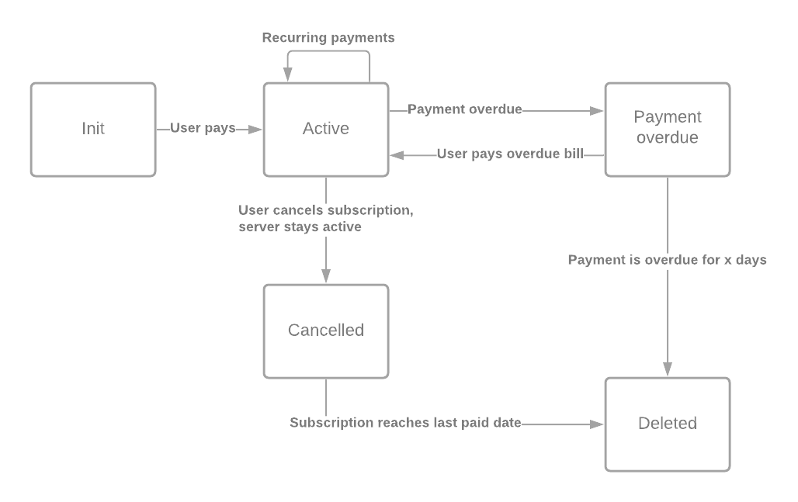

# CSMM Billing

Subscription statuses:

## Recurring 

Mollie has support for recurring payments but only for certain payment methods. To have most flexibility on these methods, we should implement our own recurring payments (with Mollie)

### createPayment(user, product)

This function creates a Mollie payment for the user and product. 

### Webhook

On success transaction:
    - Save payment date in Subscription

### Cron

- Check if any subscriptions have upcoming payments, if so -> Create a payment and send an email to user
- Check if any subscriptions are overdue if so -> Send a reminder email and set subscription as 'cancelled'