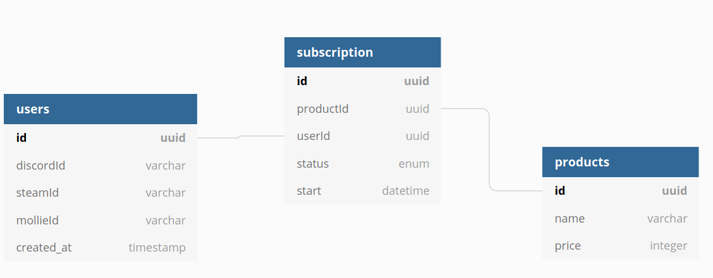

## User stories

- User logs in with password (maybe? Or just OAuth?)
- User logs in with Steam
- User logs in with Discord

- User click a 'buy' link, gets redirected to the payment proxy, authenticates and gets shown a order confirmation
- User is on order confirmation, fills in some variables (CSMM_HOSTNAME, Steam API key, ...)
- User is on order confirmation, has filled variables and clicks "Buy" -> gets redirected to Mollie

- User completes payment on Mollie -> Back to app with a 'thank you' message (Backend kicks off server provisioning)

- User logs in, sees their subscribed services
- User logs in, sees their subscribed services, cancels a service

## Backend requirements

- When payment received -> API call to Panel to provision a server
- When subscription cancelled -> Delete server from Pterodactyl after x days (so user can reactivate if wanted)

- OAuth providers (Steam, Discord) -> Can we link this to the panel somehow?

## Future

- Free trials (so option to 'upgrade' from free to paid without losing data), delete after x days
- Promo codes
